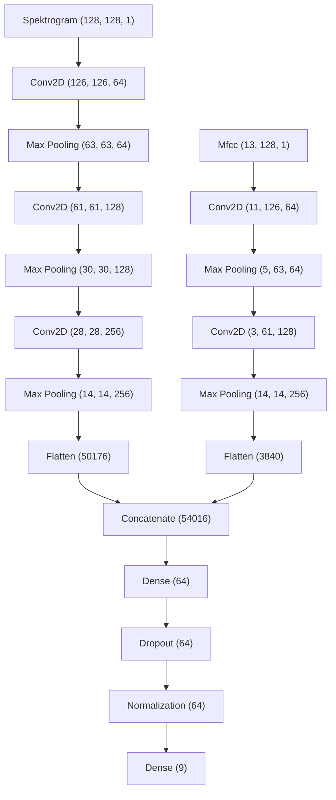

# Instruments-Classification

# Requirements
1. The project for optimal performance should be run on Linux.
2. The project requires the installation of the docker environment and the NVIDIA Container Toolkit driver in a version compatible with the version of the graphics card driver installed on the system.

# How to start
1. For training, download the dataset from the link: https://zenodo.org/records/4588740#.YFDoDdyCFPY and save it in a folder named `good-sounds` in the root directory of the project.
2. Run the `docker compose up` command from the `environment` directory. Docker will create and run the appropriate containers.
3. The running application runs on port 8000 in turn the jupyter notebook server runs on port 8888.

# Model architecture

# Model Tests
## Model training 

## Cross Validation

## Scikit-learn metrics

